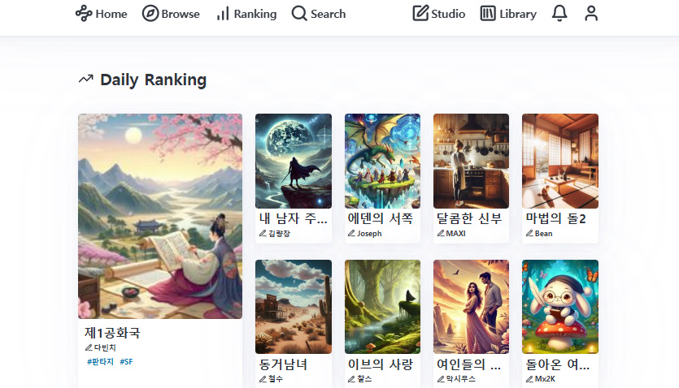
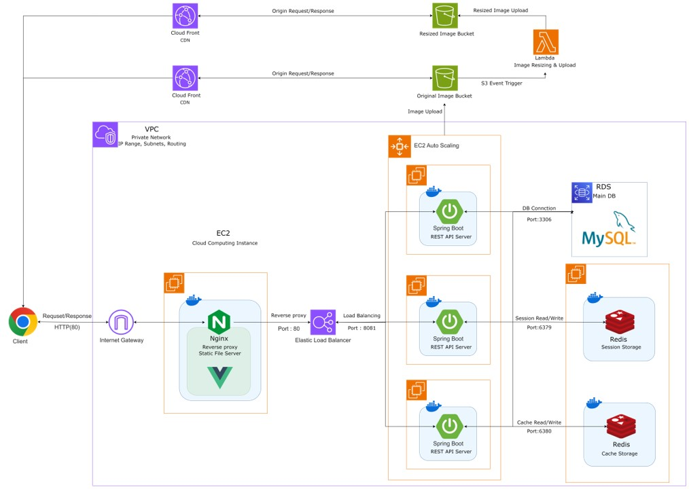

# NetNovel Backend
- Spring Boot 기반의 웹소설 플랫폼 NetNovel의 백엔드 레포지토리입니다.


## 📚 프로젝트 소개

**NetNovel**은 웹소설 작가와 독자를 연결하는 웹소설 플랫폼입니다.

- **개발 배경**: 기존 플랫폼의 한계를 극복하고, 사용자 친화적인 기능을 제공하기 위해 개발.
- **주요 사용자 대상**: 
  - **웹소설 작가**: 작품 등록, 관리, 독자와의 소통.
  - **웹소설 독자**: 선호 작품 검색 및 감상.
- **주요 목표**: 
  - **RESTful API** 설계
  - 안정적인 인증 및 데이터 관리 
  - AWS 기반 **고가용성 Cloud Infra** 구축.


- **팀 구성**:
  - **Backend/Infra**: 1명 (REST API 설계, AWS 인프라 구성, 데이터베이스 모델링)
  - **Frontend**: 1명 (Vue.js 기반 Frontend 개발, Nginx 구성)


## 📎 외부 링크

### 📄 포트폴리오
- [NetNovel Notion 포트폴리오](https://fifth-failing-a3e.notion.site/Net-Novel-14b102cd4e138060ae0ae7f3d6624bab): 프로젝트의 전반적인 개요와 세부 내용.

### 📊 ERD
- [ERD 링크](https://www.erdcloud.com/d/YTDMvwQj7CCJDEsm7): NetNovel 프로젝트의 데이터베이스 스키마.

### 📜 API 명세
- [SwaggerHub API 명세서](https://app.swaggerhub.com/apis/SKYJS135/net-novel/v1): REST API의 상세 명세서.

### 🗂️ Frontend Repository
- [Frontend Repository](https://github.com/Ham-Novel/net-novel-frontend): Vue.js 기반 프론트엔드 레포지토리.

## 📌 **프로젝트 주요 기능**

이 프로젝트는 사용자 경험과 서비스 가용성을 극대화하기 위해 다음과 같은 기능을 구현했습니다:

### 1. **에피소드 무한스크롤**
- 끊김 없는 무한스크롤 에피소드 감상 및 유료 회차 지원.
- **▶️ [시연 영상 보기](https://drive.google.com/file/d/1TD1dlra0ZeFq65hHmaJM25NcXVjBCtV5/view?usp=sharing)**

### 2. **다중 태그 소설 검색**
- 여러 태그 선택 및 최신순, 선호작순, 조회순 정렬 지원.
- **▶️ [시연 영상 보기](https://drive.google.com/file/d/11R9ypi2hLHnvKDzVyHDqRnLLbTzHXohO/view?usp=drive_link)**

### 3. **소설명 및 작가명 텍스트 검색**
- 부분 검색어만으로, 빠르고 정확한 소설 검색 지원.
- **▶️ [시연 영상 보기](https://drive.google.com/file/d/1oYdTGFA4VcmiSfnI6HdU91xYfGxPk0wk/view?usp=sharing)**

### 4. **웹소설 작성 및 업로드**
- 드래그 앤 드롭 섬네일 업로드, 자동 태그 지정 기능 제공.
- **▶️ [시연 영상 보기](https://drive.google.com/file/d/10pf0fZ5Rl2h0Ubdn2BG4tDp2eMe7qQcC/view?usp=sharing)**

### 5. **가중치 기반 랭킹 시스템**
- 사용자 참여도(조회수, 좋아요 등)를 기반으로 신뢰도 높은 콘텐츠 랭킹 제공.
- **▶️ [시연 영상 보기](https://drive.google.com/file/d/18JxtQhm8m5uPWYsBvU5azjhRESwK4LYD/view?usp=sharing)**

### 6. **최근 본 소설 및 선호작 관리**
- **최근 본 소설** 이어 읽기 및 **선호작** 최신순 정렬 기능 제공.
- **▶️ [시연 영상 보기](https://drive.google.com/file/d/1ihczB0ln0sBzPnIUC4n2y5j8lukquGLe/view?usp=sharing)**

### 7. **댓글/대댓글 시스템**
- 좋아요/싫어요, 댓글 정렬 및 사용자 피드백 반영 기능 제공.
- **▶️ [시연 영상 보기](https://drive.google.com/file/d/1eqd9BGuxxr_nyu6vEgoIa9BgnyXwdNRL/view?usp=sharing)**


## 🛠️ 주요 기술 스택 및 시스템 아키텍처
- **Backend**: Java, Spring Boot, Spring Security, Spring Data JPA  
- **Frontend**: Vue.js, Nginx  
- **Database**: MySQL, Redis  
- **Cloud**: AWS (EC2, RDS, S3, Lambda, ELB, Auto Scaling, CloudFront)  
- **DevOps**: Docker, Jenkins  
- **Tools**: DBeaver, Postman, K6  


## 🌐 시스템 아키텍처


 **설명**: Backend(Spring Boot), Frontend(Vue.js), AWS 기반 클라우드 인프라, Docker 및 Jenkins로 CI/CD를 구성하였습니다.
>


## 프로젝트 구조

```
📦java
 ┗ 📂com
 ┃ ┗ 📂ham
 ┃ ┃ ┗ 📂netnovel
 ┃ ┃ ┃ ┣ 📂coinChargeHistory   # 코인 충전 내역 관리 
 ┃ ┃ ┃ ┃ ┣ 📂dto              # 데이터 전송 객체 (Request/Response)
 ┃ ┃ ┃ ┃ ┣ 📂service          # 비즈니스 로직 구현
 ┃ ┃ ┃ ┃ ┗ 📂repository       # DB 접근 레이어
 ┃ ┃ ┃ ┣ 📂coinCostPolicy      # 코인 비용 정책 관리 
 ┃ ┃ ┃ ┃ ┣ 📂dto
 ┃ ┃ ┃ ┃ ┣ 📂service
 ┃ ┃ ┃ ┃ ┗ 📂repository
 ┃ ┃ ┃ ┣ 📂coinUseHistory      # 코인 사용 내역 관리 
 ┃ ┃ ┃ ┃ ┣ 📂dto
 ┃ ┃ ┃ ┃ ┣ 📂service
 ┃ ┃ ┃ ┃ ┗ 📂repository
 ┃ ┃ ┃ ┣ 📂comment             # 댓글 관리 (서비스/레포지토리 통합)
 ┃ ┃ ┃ ┣ 📂commentLike         # 댓글 좋아요 관리
 ┃ ┃ ┃ ┣ 📂common              # 공통 기능 (유틸리티, 설정, 예외 등)
 ┃ ┃ ┃ ┃ ┣ 📂AWS              # AWS 서비스 연동 관련 설정
 ┃ ┃ ┃ ┃ ┣ 📂batch            # 배치 작업 및 스케줄링
 ┃ ┃ ┃ ┃ ┣ 📂config           # 프로젝트 전역 설정
 ┃ ┃ ┃ ┃ ┣ 📂exception        # 사용자 정의 예외 및 핸들러
 ┃ ┃ ┃ ┃ ┣ 📂OAuth            # OAuth 인증 처리
 ┃ ┃ ┃ ┃ ┣ 📂scheduler        # 스케줄링 작업
 ┃ ┃ ┃ ┃ ┃ ┣ 📂config
 ┃ ┃ ┃ ┃ ┃ ┗ 📂job
 ┃ ┃ ┃ ┃ ┗ 📂utils            # 공통 유틸리티 클래스
 ┃ ┃ ┃ ┣ 📂episode            # 에피소드 관리
 ┃ ┃ ┃ ┣ 📂episodeViewCount   # 에피소드 조회수 관리
 ┃ ┃ ┃ ┣ 📂favoriteNovel      # 즐겨찾기 소설 관리
 ┃ ┃ ┃ ┣ 📂member             # 사용자 정보 관리
 ┃ ┃ ┃ ┣ 📂novel              # 소설 관리
 ┃ ┃ ┃ ┣ 📂novelAverageRating # 소설 평균 평점 관리
 ┃ ┃ ┃ ┣ 📂novelMetaData      # 소설 메타데이터 관리
 ┃ ┃ ┃ ┣ 📂novelRanking       # 소설 랭킹 관리
 ┃ ┃ ┃ ┣ 📂novelRating        # 소설 평점 관리
 ┃ ┃ ┃ ┣ 📂novelTag           # 소설 태그 관리
 ┃ ┃ ┃ ┣ 📂recentRead         # 최근 읽은 기록 관리
 ┃ ┃ ┃ ┣ 📂reComment          # 대댓글 관리
 ┃ ┃ ┃ ┣ 📂reCommentLike      # 대댓글 좋아요 관리
 ┃ ┃ ┃ ┣ 📂s3                 # S3 연동
 ┃ ┃ ┃ ┣ 📂settlement         # 정산 관련 관리
 ┃ ┃ ┃ ┗ 📂tag                # 태그 관리

```

